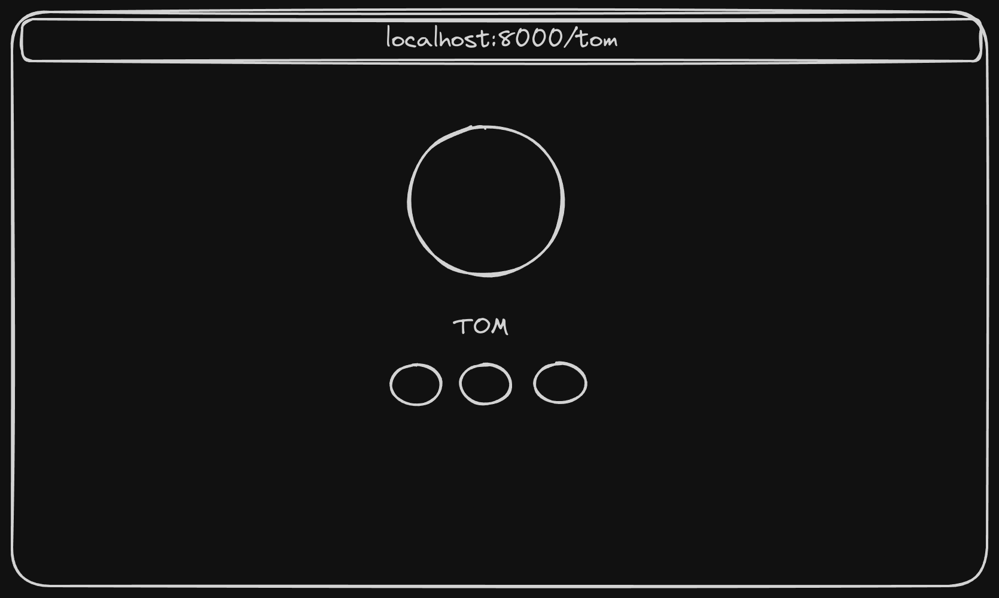
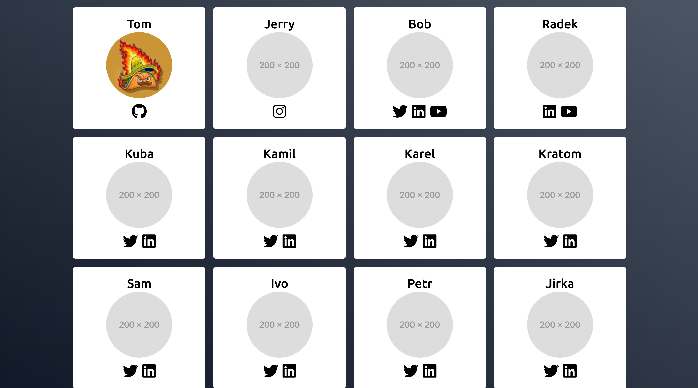

# DCUK - PRAXE 24

## Description

Goal is to create a simple web application that will allow users to create, read, update simple portfolio.

## Screenshots






## TODO

- [ ] Add SQLite database
- [ ] Routes for adding, updating and deleting user
- [ ] Frontend for adding, updating and deleting user
- [ ] Simple authentication

## Quick demo

```bash
docker-compose up -d
```

## Technologies

- FastAPI
- SQLite
- Tailwind CSS
- FontAwesome

## Installation

```bash
pip install virtualenv
virtualenv venv
source ./venv/bin/activate
pip install -r requirements.txt
```

Tip: you can seed users by running `python3 seed_users.py`

## API

```bash
cd backend
uvicorn main:app --reload
```

## Frontend

```bash
cd frontend
npx vite
```

or any other web server
