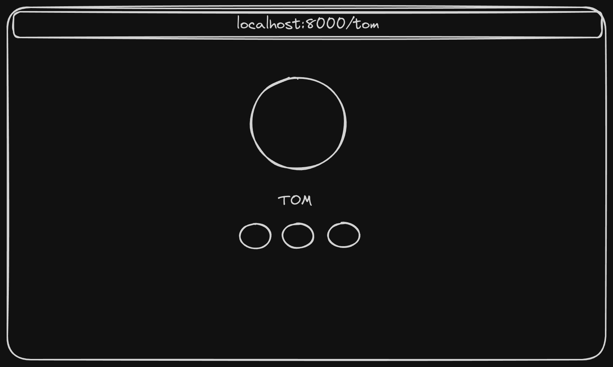

# DCUK - PRAXE 24

Tom mentor dcuk praxí 24



Goal is to create a simple web application that will allow users to create, read, update simple portfolio.

## TODO

- [] Add SQLite database
- [] Routes for adding, updating and deleting user
- [] Frontend for adding, updating and deleting user
- [] Simple authentication

## Technologies

- FastAPI
- SQLite
- Tailwind CSS
- FontAwesome

## Installation

```bash
pip install virtualenv
virtualenv venv
source ./venv/bin/activate
pip install -r requirements.txt
```

Tip: you can seed users by running `python3 seed_users.py`

## API

```bash
uvicorn main:app --reload
```

## Frontend

```bash
npx vite
```
